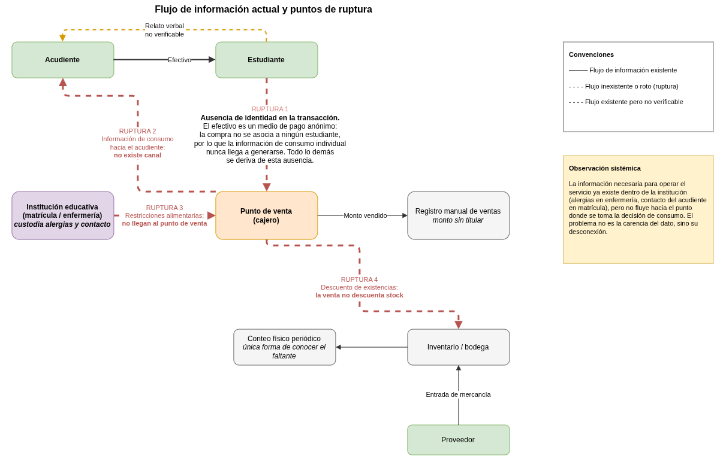

# SmartFood — Documento fuente estructurado para consumo por agentes

## [S0] Bloque de control del documento

### [S0.1] Metadatos

| Campo | Valor |
|---|---|
| doc_id | SMARTFOOD-TIC1-001 |
| titulo_original | SmartFood, una plataforma de gestión para cafeterías escolares con control parental y trazabilidad digital |
| archivo_origen | `corpus:original-documents/smartfood.docx` — el DOCX original **no está en este repositorio**; vive en el corpus documental de la asignatura |
| tipo_documento | Anteproyecto académico / bosquejo de proyecto |
| procedencia | Copia de trabajo. El maestro estaba en el corpus documental de la asignatura (repositorio `tic1`, local). **A partir del traslado, este fichero es el vigente**: no editar la copia del corpus. |
| institucion | Universidad Pontificia Bolivariana |
| unidad | Escuela de Ingeniería |
| asignatura | Proyecto aplicado en TIC 1 |
| docente | Yuri Marcela Escobar |
| fecha_documento | 2026-08-04 |
| autores | Naomi Chow Morelos; Alejandro Monak Monsalve; Pedro José Gómez López; Carlos Andrés Arroyave Londoño |
| autor_metadato_archivo | Naomi Chow |
| creado (metadato) | 2026-07-28T23:50:00Z |
| modificado (metadato) | 2026-08-05T00:42:00Z |
| revision (metadato) | 7 |
| extension_original | 27 páginas / 7.376 palabras |
| idioma | es-CO |
| figuras | 3 (FIG-01, FIG-02, FIG-03), transcritas en texto |
| comentarios_revision | 4 (ver ANEXO B) |
| version_estructurada | 1.0 |

### [S0.2] Instrucciones de lectura para el agente

Este documento es una reexpresión estructurada del original. Reglas de interpretación:

1. Todo texto no marcado es **verbatim** del documento original; no fue reescrito, resumido ni corregido.
2. Los bloques marcados `[DERIVADO]` no existen en el original: son reorganizaciones tabulares de información ya contenida en él, creadas para lectura por máquina. No introducen datos nuevos ni alteran cifras.
3. Los bloques marcados `[VISIÓN]` son transcripciones textuales de imágenes del original, obtenidas por visión artificial. Cada figura conserva además su imagen embebida.
4. Los identificadores entre corchetes (`[S1]`, `[OBJ-E3]`, `[RUP-2]`, `[ALC-IN-04]`, `[REF-05]`, …) son estables y citables. Fueron asignados en esta versión; el original no los incluye.
5. El orden de las secciones respeta el orden del documento original.
6. Los comentarios de revisión incrustados en el archivo original se preservan en el ANEXO B con su texto de anclaje.
7. Ninguna cifra, porcentaje, fecha, nombre propio o referencia bibliográfica fue modificada.

### [S0.3] Mapa de secciones

| ID | Sección | Contenido |
|---|---|---|
| S1 | Introducción | Contexto, situación actual, brecha |
| S2 | Descripción del problema | Formulación, impacto y evidencias |
| S3 | Justificación | Importancia, benchmarking, impacto esperado |
| S4 | Objetivos | 1 general + 7 específicos |
| S5 | Contexto organizacional | Tipo de organización, usuarios, procesos |
| S6 | Proceso actual de compra | Secuencia de 8 pasos + FIG-01 |
| S7 | Flujo de información y puntos de ruptura | 4 rupturas + FIG-02 |
| S8 | Ubicación sistémica del servicio | FIG-03 |
| S9 | Alcance del proyecto | Incluido, excluido y entregables |
| S10 | Descripción preliminar de la solución TIC | Tipo de sistema y funciones |
| S11 | Matriz preliminar de roles y permisos | Tabla de permisos |
| S12 | Líder del proyecto y roles preliminares | Equipo |
| S13 | Bibliografía | 10 referencias |
| A | ANEXO A | Índice de entidades y glosario |
| B | ANEXO B | Comentarios de revisión del archivo original |
| C | ANEXO C | Nota de procedencia de esta versión |

## [S1] Introducción

### [S1.1] Contexto

Las instituciones educativas buscan ofrecer un servicio de cafetería que sea seguro, eficiente y que contribuya al bienestar de los estudiantes. Sin embargo, muchas cafeterías escolares aún operan mediante procesos tradicionales basados en pagos en efectivo y registros manuales, lo que dificulta la administración del servicio y el seguimiento del consumo alimenticio de los estudiantes. Aunque este servicio suele percibirse como un proceso operativo secundario, en realidad involucra a ciertos actores con intereses distintos; el primero es el estudiante, que busca autonomía y practicidad al momento de realizar sus compras; luego están los padres de familia o acudientes, que buscan seguridad económica y un mayor control sobre la alimentación de sus hijos; y por último, está la institución educativa, que debe administrar las ventas, el inventario y el cumplimiento de las normativas relacionadas con la alimentación escolar. Por esta razón, es necesario gestionar estos tres frentes de manera conjunta, ya que un fallo o deficiencia en cualquiera de ellos puede repercutir negativamente en los demás.

`[DERIVADO]` Actores y su interés declarado en S1.1:

| ID | Actor | Interés declarado |
|---|---|---|
| ACT-1 | Estudiante | Autonomía y practicidad al comprar |
| ACT-2 | Padres de familia o acudientes | Seguridad económica y control sobre la alimentación de sus hijos |
| ACT-3 | Institución educativa | Administrar ventas, inventario y cumplimiento normativo de alimentación escolar |

### [S1.2] Situación actual

Actualmente, en muchas cafeterías escolares los estudiantes realizan sus compras utilizando dinero en efectivo, sin que exista un mecanismo que permita controlar el acceso a determinados alimentos de acuerdo con restricciones nutricionales o decisiones definidas por los padres. Como consecuencia, estos no cuentan con información en tiempo real sobre qué alimentos consumen sus hijos ni cuánto dinero gastan durante la jornada escolar, lo que limita considerablemente su capacidad para supervisar el consumo diario de sus hijos dentro de la institución.

A esta situación se suma que la administración de ventas e inventarios suele realizarse de forma manual o mediante herramientas poco integradas entre sí, sin una vinculación digital entre el perfil de los padres y el de los estudiantes que permita que decisiones como restricciones alimenticias, límites de gasto o autorizaciones específicas dadas por los acudientes se reflejen automáticamente en el punto de venta. Del mismo modo, el modelo tradicional tampoco ofrece la posibilidad de que un padre realice un pedido anticipado para que su hijo simplemente lo reclame en la cafetería, sin necesidad de decidir o pagar en el momento de la compra. En la práctica, las opciones de los padres se reducen a entregar dinero en efectivo y confiar en que el estudiante tome decisiones adecuadas por su cuenta.

Esta situación adquiere una mayor relevancia, debido a que, según cifras del Instituto Colombiano de Bienestar Familiar, el exceso de peso en menores en edad escolar en Colombia pasó del 18,8 % en 2010 al 24,4 % en 2015 (Osorio-Mejía et al., 2022). Estos datos evidencian que la falta de mecanismos de seguimiento y control sobre los hábitos alimenticios en espacios como la cafetería escolar no es un asunto menor, sino un factor que puede contribuir a una tendencia creciente entre los jóvenes relacionado a malos hábitos alimenticios, frente a la cual los padres disponen actualmente de muy pocas herramientas de intervención temprana.

### [S1.3] Brecha entre la situación actual y la situación deseada

> Nota de revisión asociada a esta sección: ver `[COM-01]` en el ANEXO B.

Existe una brecha entre el modelo tradicional de gestión de cafeterías y la necesidad de contar con un sistema digital que integre pagos electrónicos, control nutricional, supervisión parental y herramientas de administración. Reducir esta brecha requiere implementar una plataforma tecnológica que permita automatizar las operaciones de la cafetería, mejorar la seguridad de las transacciones, facilitar el seguimiento del consumo de los estudiantes y brindar información oportuna tanto a los padres como a la institución educativa.

## [S2] Descripción del problema

### [S2.1] Formulación clara del problema

En las instituciones educativas que ofrecen el servicio de cafetería para estudiantes de colegio, el proceso de compra y venta de alimentos presenta una gestión ineficiente, debido a que, en su mayoría, se realiza de forma manual y no cuenta con la trazabilidad digital necesaria para dar solución a diversas problemáticas asociadas a la limitada visibilidad e involucramiento de los padres respecto a lo que consumen sus hijos en estos espacios, así como la ineficiencia operativa de las cafeterías para mantener un registro sistemático y verificable de las ventas y del inventario, lo que genera riesgos de seguridad económica para los estudiantes, pérdida de control de los padres sobre los hábitos alimenticios y el gasto de sus hijos, falta de nutrientes necesarios para el correcto desarrollo cognitivo del niño, y una gestión administrativa ineficiente y propensa a errores para la institución, al no existir un mecanismo que vincule el perfil del padre con el del estudiante para restringir alimentos, controlar el saldo disponible o gestionar pedidos anticipados en el punto de venta.

`[DERIVADO]` Consecuencias enunciadas en la formulación:

| ID | Consecuencia | Afectado |
|---|---|---|
| CON-1 | Riesgos de seguridad económica | Estudiante |
| CON-2 | Pérdida de control sobre hábitos alimenticios y gasto | Acudiente |
| CON-3 | Falta de nutrientes necesarios para el desarrollo cognitivo | Estudiante |
| CON-4 | Gestión administrativa ineficiente y propensa a errores | Institución / cafetería |

Causa raíz declarada: no existe un mecanismo que vincule el perfil del padre con el del estudiante para restringir alimentos, controlar el saldo disponible o gestionar pedidos anticipados en el punto de venta.

### [S2.2] Impacto, evidencias o síntomas observados

Esta situación genera que los estudiantes pierdan entre 10 y 15 minutos en las filas durante el receso. Además, un estudio realizado con apoyo del Departamento Administrativo Nacional de Estadística (DANE) confirmó que el 56 % de los estudiantes reportó haber sido víctima del robo dentro del colegio durante el último año (Chaux & Velásquez, 2008), siendo el dinero en efectivo el primer artículo de la lista, lo que evidencia que el manejo de efectivo representa un riesgo para los jóvenes en el entorno escolar.

Asimismo, se sabe que los niños y adolescentes colombianos presentan una alta preferencia por los alimentos procesados: el 79,3 % consume embutidos al menos una vez al mes; el 51,9 %, comidas rápidas; el 83,7 %, gaseosas; el 85 %, alimentos de paquete; y el 89,3 %, dulces y golosinas (Elizabeth et al., 2019). Esto plantea una situación preocupante, ya que muchos padres carecen de información suficiente para intervenir de manera temprana en patrones alimenticios poco saludables.

De igual forma, el desarrollo cognitivo de los niños depende directamente de una nutrición adecuada, aproximadamente el 20% de la energía diaria del cuerpo se destina al funcionamiento del cerebro, y micronutrientes como el hierro, el zinc y las vitaminas del complejo B son esenciales para el aprendizaje. La falta de estos nutrientes puede afectar el desarrollo neuronal y derivar en un menor rendimiento académico, lo que evidencia que el tipo de alimentación que reciben los estudiantes en el colegio no es un asunto secundario, sino un factor que incide directamente en su capacidad de aprendizaje (Word Food Program USA, 2023).

Además de los hábitos de alimentación poco saludables, existe otro problema que el sistema propuesto busca atender, que son las alergias alimentarias. Según la Organización Mundial de Alergia (WAO), la prevalencia de las alergias alimentarias en la población infantil se encuentra entre el 4 % y el 6 % a nivel mundial (Universidad de Antioquia, 2019). En Colombia, sin embargo, la información específica sobre este tema aún es limitada. Investigadores de la Universidad de Antioquia han señalado que existen pocos estudios sobre los principales alimentos alergénicos presentes en el país, lo que dificulta que las instituciones educativas y los padres de familia cuenten con herramientas e información suficientes para gestionar este tipo de riesgo.

Esta situación hace aún más relevante la implementación de un sistema que permita a los padres registrar restricciones alimentarias específicas para sus hijos y que dichas restricciones se apliquen automáticamente durante el proceso de compra en la cafetería. A diferencia de otros problemas relacionados con la alimentación, una reacción alérgica puede presentarse de manera inmediata y requerir atención médica urgente, por lo que evitar la venta de productos que contengan determinados alérgenos constituye una medida preventiva importante dentro del entorno escolar.

Por otra parte, según un estudio de la National Restaurant Association, la ausencia de un registro digital y seguro de las ventas a los estudiantes dificulta el control del inventario y de la bodega, lo que genera errores en los pedidos y un desperdicio anual cercano al 10 % en costos de alimentos, debido a la imposibilidad de comprobar con precisión lo que realmente se vendió frente a lo entregado por el proveedor (Bardwaj, 2025).

`[DERIVADO]` Cifras de evidencia extraídas de S1.2 y S2.2, sin alteración de valores:

| ID | Indicador | Valor | Fuente citada en el texto |
|---|---|---|---|
| EV-01 | Tiempo perdido en filas durante el receso | 10 a 15 minutos | (sin cita en el original) |
| EV-02 | Estudiantes víctimas de robo dentro del colegio en el último año | 56 % | Chaux & Velásquez, 2008 (con apoyo del DANE) |
| EV-03 | Artículo más robado | Dinero en efectivo (primer lugar) | Chaux & Velásquez, 2008 |
| EV-04 | Exceso de peso en menores en edad escolar, Colombia, 2010 | 18,8 % | Osorio-Mejía et al., 2022 (cifras ICBF) |
| EV-05 | Exceso de peso en menores en edad escolar, Colombia, 2015 | 24,4 % | Osorio-Mejía et al., 2022 (cifras ICBF) |
| EV-06 | Consume embutidos al menos 1 vez al mes | 79,3 % | Elizabeth et al., 2019 |
| EV-07 | Consume comidas rápidas | 51,9 % | Elizabeth et al., 2019 |
| EV-08 | Consume gaseosas | 83,7 % | Elizabeth et al., 2019 |
| EV-09 | Consume alimentos de paquete | 85 % | Elizabeth et al., 2019 |
| EV-10 | Consume dulces y golosinas | 89,3 % | Elizabeth et al., 2019 |
| EV-11 | Energía diaria del cuerpo destinada al cerebro | ~20 % | Word Food Program USA, 2023 |
| EV-12 | Prevalencia mundial de alergias alimentarias en población infantil | 4 % a 6 % | WAO, citada por Universidad de Antioquia, 2019 |
| EV-13 | Desperdicio anual en costos de alimentos por falta de registro digital | ~10 % | Bardwaj, 2025 (estudio National Restaurant Association) |

Micronutrientes señalados como esenciales para el aprendizaje: hierro, zinc y vitaminas del complejo B.

## [S3] Justificación

> Nota de revisión asociada a esta sección: ver `[COM-02]` en el ANEXO B.

El desarrollo de un sistema para la gestión alimentaria de los estudiantes en instituciones educativas es importante porque permite a los padres de familia establecer y controlar las restricciones alimentarias y los tipos de alimentos que sus hijos pueden consumir dentro de la cafetería escolar. De esta manera, se favorece un mayor seguimiento de los hábitos de alimentación de los estudiantes y se contribuye tanto a su salud y bienestar como a una mejor administración del dinero destinado a sus compras durante la jornada escolar.

En el mercado existen soluciones similares, tales como en el sector farmacéutico como el software Nixfarma en España, donde hay gestión de ventas y dispensa para medicamentos, haciendo los pagos de forma sistemática, al igual que gestión de inventario para que los clientes tengan control de medicamentos existentes y de medicamentos que pueden tomar, cumpliendo las normas farmacéuticas de su país, como lo sería la gestión de receta electrónica y la protección de datos. También hace análisis e informes de indicadores de compras y uso de los medicamentos.

Sus diferencias están en que son de diferentes sectores, mientras que la solución que se va a implementar es para el sector de las escuelas, Nixfarma está plenamente enfocada para el sector farmacéutico.

Por otra parte, en el sector educativo existen soluciones más cercanas al problema planteado, como MySchoolBucks, una plataforma utilizada en Estados Unidos que permite a los padres cargar saldo a la cuenta de alimentación de sus hijos, consultar el historial de compras y recibir alertas cuando el saldo es bajo. El sistema utiliza una tarjeta con código de barras como mecanismo de identificación para los estudiantes, especialmente en los niveles de educación primaria. Sin embargo, la gestión de restricciones alimentarias en MySchoolBucks depende de un proceso manual, en el que los padres deben diligenciar un formulario que posteriormente es procesado por el personal encargado, sin que exista una validación automática en el punto de venta. La propuesta desarrollada en este proyecto se diferencia al automatizar completamente ese proceso, vinculando el perfil del padre con el del estudiante para que las restricciones alimentarias y el saldo disponible se apliquen en tiempo real durante cada compra. Además, incorpora un módulo de pedidos anticipados, funcionalidad que no está contemplada dentro del alcance de MySchoolBucks.

Se espera que el proyecto genere un impacto positivo tanto para las instituciones educativas como para los estudiantes y sus familias, ya que se estima una reducción aproximada del 40 % en los tiempos de espera en las filas de la cafetería y una mejora cercana al 80 % en la gestión del inventario. Estas estimaciones se sustentan en la posibilidad de registrar las transacciones de forma digital, controlar el inventario en tiempo real y generar alertas oportunas sobre la disponibilidad de los productos. Y, desde el punto de vista social, el sistema permitiría un mayor control sobre la alimentación de los estudiantes, ya que las restricciones alimentarias definidas por los padres se aplicarían automáticamente durante el proceso de compra. Esto facilitaría el seguimiento de los hábitos de consumo dentro de la institución educativa y ofrecería a los padres información más precisa sobre los alimentos que consumen sus hijos durante la jornada escolar.

De igual forma, se estima que el sistema podría beneficiar directamente a entre 500 y 1.200 estudiantes y sus respectivas familias por institución, dependiendo del tamaño del colegio. Asimismo, contribuiría a disminuir las pérdidas económicas asociadas al manejo de efectivo, como robos o extravíos, y a reducir el desperdicio de inventario derivado de la falta de trazabilidad entre los productos comprados y los productos vendidos.

`[DERIVADO]` Benchmarking declarado:

| ID | Solución | Sector / país | Funciones citadas | Diferencia frente a la propuesta |
|---|---|---|---|---|
| BM-1 | Nixfarma | Farmacéutico, España | Gestión de ventas y dispensa, pagos sistemáticos, gestión de inventario, receta electrónica, protección de datos, análisis e informes | Sector distinto: Nixfarma está enfocada en farmacias; la propuesta se dirige al sector escolar |
| BM-2 | MySchoolBucks | Educativo, Estados Unidos | Carga de saldo por los padres, historial de compras, alertas de saldo bajo, tarjeta con código de barras | Restricciones alimentarias gestionadas manualmente por formulario, sin validación automática en el punto de venta; no contempla pedidos anticipados |

`[DERIVADO]` Impacto estimado declarado:

| ID | Métrica esperada | Valor |
|---|---|---|
| IMP-1 | Reducción de tiempos de espera en filas | ~40 % |
| IMP-2 | Mejora en la gestión del inventario | ~80 % |
| IMP-3 | Beneficiarios directos por institución | 500 a 1.200 estudiantes y sus familias |

## [S4] Objetivos

### [S4.1] Objetivo general

`[OBJ-GEN]` Desarrollar un prototipo funcional de plataforma de gestión para cafeterías escolares que sustituya el manejo de efectivo por una cuenta digital por estudiante, permitiendo al acudiente controlar el saldo, el límite de gasto y las restricciones alimentarias de su hijo, y a la cafetería operar el punto de venta y el inventario con trazabilidad verificable, en colegios privados de educación básica y media.

### [S4.2] Objetivos específicos

`[OBJ-E1]` Caracterizar el proceso actual de compra en la cafetería y el flujo de información entre acudiente, estudiante, cafetería e institución, identificando los puntos donde se pierde trazabilidad.

`[OBJ-E2]` Implementar el registro de estudiantes y acudientes bajo control de la institución educativa, mediante carga masiva validada e invitación por correo, de modo que ninguna cuenta con acceso a datos de menores se cree por autorregistro.

`[OBJ-E3]` Generar reportes de consumo para el acudiente a partir de la información nutricional registrada en cada venta, incluyendo recomendaciones de carácter informativo basadas en reglas determinísticas sobre frecuencia de consumo, agregados nutricionales y gasto.

`[OBJ-E4]` Implementar la billetera por estudiante y el punto de venta con identificación por tarjeta, garantizando que el saldo siempre se pueda reconstruir a partir del historial de movimientos y que ninguna venta deje saldo negativo.

`[OBJ-E5]` Implementar el control parental sobre el consumo (límite diario de gasto, bloqueo de productos y bloqueo por alérgeno) aplicado en el momento de la venta y no modificable por el personal de la cafetería.

`[OBJ-E6]` Implementar la gestión de catálogo e inventario de la cafetería sobre unidades vendibles, con registro auditable de movimientos que permita explicar las existencias a partir de su historial.

`[OBJ-E7]` Validar el prototipo mediante un plan de pruebas sobre los escenarios críticos: venta rechazada por alérgeno bloqueado, venta rechazada por saldo o cupo insuficiente, y cuadre entre saldo mostrado e historial de movimientos.

## [S5] Contexto organizacional

### [S5.1] Tipo de organización

El proyecto está dirigido a instituciones educativas privadas de educación básica y media ubicadas en zonas urbanas de Colombia que cuentan con un servicio de cafetería dentro de sus instalaciones. Como referencia, se consideran instituciones con una población aproximada de entre 500 y 1.000 estudiantes, ya que este rango representa un tamaño común en muchos colegios privados del país y permite plantear una solución acorde con una operación cotidiana.

Más que el número total de estudiantes, lo que realmente influye en el funcionamiento de la cafetería es que la mayoría de las compras se concentra durante los períodos de descanso. En la práctica, casi todas las transacciones ocurren en una o dos jornadas de receso de aproximadamente 20 a 30 minutos, durante los cinco días de la semana. Por ejemplo, en una institución con 800 estudiantes, si alrededor del 60 % compra en la cafetería durante el receso, se deben atender cerca de 480 transacciones en un tiempo muy reducido. Generalmente, estas compras son atendidas por un punto de venta con entre dos y cinco personas, lo que hace que se formen filas y aumenten los tiempos de espera. Este escenario es importante porque permite definir las condiciones bajo las cuales debe funcionar el sistema propuesto, pues más que responder al promedio de ventas del día, debe ser capaz de operar correctamente durante los momentos de mayor demanda, cuando se concentra la mayor cantidad de estudiantes comprando al mismo tiempo.

Esta concentración de compras durante el receso también genera una condición importante para el funcionamiento del sistema. El punto de venta necesita contar con una conexión estable precisamente en el momento en que se registra la mayor cantidad de transacciones, por lo que la disponibilidad del servicio durante ese período resulta fundamental para que la operación no se vea afectada.

La cafetería funciona como un servicio comercial interno de la institución educativa y puede operar bajo dos modalidades, ya sea ser administrada directamente por el colegio o ser gestionada por una empresa externa contratada para prestar el servicio. Esta diferencia es importante porque implica que la institución educativa y el operador de la cafetería cumplen funciones distintas dentro del proceso. Asimismo, la institución es responsable del tratamiento y protección de los datos personales de los estudiantes menores de edad, de acuerdo con lo establecido en la Ley 1581 de 2012, mientras que el operador de la cafetería se encarga de aspectos como la venta de productos, el manejo del menú y el control del inventario. Por esta razón, el sistema propuesto debe respetar esa distribución de responsabilidades y permitir que cada actor gestione únicamente la información y los procesos que le corresponden.

En cualquiera de las dos modalidades de operación, los estudiantes realizan sus compras utilizando dinero propio para adquirir los productos que desean consumir. Actualmente, la gestión de la cafetería sigue siendo un proceso mayoritariamente manual e independiente de otros sistemas de la institución. Las ventas, el control del inventario y el registro de las transacciones suelen manejarse de forma separada, sin una integración con procesos institucionales como los pagos de matrícula u otros procedimientos administrativos. Como consecuencia, la información se encuentra dispersa y resulta más difícil realizar un seguimiento eficiente tanto de las ventas como del consumo de los estudiantes.

Dentro de este contexto, el proyecto se enfoca exclusivamente en cafeterías escolares que funcionan bajo un modelo comercial, en el que los estudiantes pagan por los productos que consumen. Por esta razón, no se contemplan los esquemas de alimentación subsidiada o de complemento alimentario, como el Programa de Alimentación Escolar (PAE), ya que estos operan bajo un modelo diferente, regulado por normas específicas y orientado a la atención de beneficiarios dentro del sistema público. Su funcionamiento responde a condiciones distintas a las que se busca abordar en esta propuesta.

Además, el proyecto se desarrolla dentro del marco normativo aplicable a las cafeterías escolares. En particular, la Ley 2120 de 2021 promueve la adopción de medidas orientadas a fomentar entornos alimentarios saludables y a garantizar el derecho fundamental a la salud de los niños, niñas y adolescentes (Gobierno de Colombia, 2021). En consecuencia, las cafeterías que funcionan dentro de instituciones educativas, ya sean administradas directamente por el colegio o por un operador externo, deben desarrollar sus actividades de acuerdo con estos lineamientos. Estas normas respaldan la propuesta planteada y orienta decisiones del sistema relacionadas con el control del consumo, la gestión de restricciones alimentarias y el seguimiento de la información disponible para los padres de familia.

`[DERIVADO]` Parámetros operativos y restricciones de diseño declarados en S5.1:

| ID | Parámetro | Valor declarado |
|---|---|---|
| PAR-1 | Tipo de institución objetivo | Colegios privados, educación básica y media, zona urbana, Colombia |
| PAR-2 | Población de referencia | 500 a 1.000 estudiantes |
| PAR-3 | Ventana de demanda | 1 o 2 recesos de 20 a 30 minutos, 5 días por semana |
| PAR-4 | Caso de carga de ejemplo | 800 estudiantes × 60 % ≈ 480 transacciones en la ventana de receso |
| PAR-5 | Personal en el punto de venta | 2 a 5 personas |
| PAR-6 | Requisito de conectividad | Conexión estable durante la ventana de receso; disponibilidad crítica |
| PAR-7 | Modalidades de operación de la cafetería | Administrada por el colegio, o concesionada a un operador externo |
| PAR-8 | Marco normativo aplicable | Ley 1581 de 2012 (datos personales); Ley 2120 de 2021 (entornos alimentarios saludables) |
| PAR-9 | Modelo excluido | Alimentación subsidiada / PAE (sistema público) |

### [S5.2] Usuarios involucrados

#### `[USR-1]` Estudiantes

Pertenecen a los niveles de educación básica y media y tienen edades entre los 5 y los 17 años. Son los principales usuarios del servicio de cafetería, ya que interactúan directamente con el personal del punto de venta para adquirir los productos ofrecidos y, por lo general, realizan sus compras utilizando el dinero en efectivo que les proporcionan sus padres o acudientes.

Aunque la institución educativa les asigna un identificador, como el número de documento o el carné estudiantil, este no se utiliza durante el proceso de compra en la cafetería. La transacción se realiza mediante el pago en efectivo, sin que el estudiante sea identificado en el sistema, por lo que las ventas suelen registrarse únicamente como un monto total, sin asociarse a una persona específica. Esta situación dificulta que los padres puedan conocer con precisión qué productos consumen sus hijos y limita la posibilidad de aplicar restricciones alimentarias individuales en el momento de la compra.

Además, el amplio rango de edad de los estudiantes influye directamente en el diseño de la solución propuesta. Un niño de cinco años, por ejemplo, no suele administrar contraseñas, aplicaciones o dispositivos personales, por lo que el mecanismo de identificación no puede depender de que el estudiante gestione una cuenta o utilice un teléfono móvil para realizar sus compras.

#### `[USR-2]` Acudientes

Son los responsables del cuidado y bienestar del estudiante. Actualmente, les proporcionan dinero en efectivo para que puedan realizar compras durante el receso y, en la mayoría de los casos, no tienen contacto directo con la cafetería ni con la institución en lo relacionado con el consumo alimentario de sus hijos. La única información que reciben sobre lo que el estudiante consumió durante la jornada escolar proviene de lo que este mismo les cuenta al llegar a casa, por lo que no existe un mecanismo que les permita hacer seguimiento o ejercer algún tipo de control sobre sus hábitos de consumo.

Esta situación resulta aún más importante cuando el estudiante presenta una alergia, una condición médica o una restricción alimentaria, ya que el acudiente no dispone de una herramienta que permita hacer efectiva esa restricción en el punto de venta de la cafetería. Para este actor, el aspecto más importante no es el rango de edad, sino el acceso a un teléfono inteligente con conexión a internet y un nivel básico de alfabetización digital. La solución propuesta se apoya en una interfaz web adaptable a dispositivos móviles a través de la cual los padres podrán consultar el consumo de sus hijos, establecer restricciones alimentarias y administrar el saldo disponible para las compras dentro de la cafetería.

#### `[USR-3]` Cajeros de la cafetería

Están conformados por un grupo de entre dos y cinco personas encargadas de atender el punto de venta durante los períodos de receso. Su labor consiste en recibir los pagos de los estudiantes, calcular el valor de las compras, entregar el cambio correspondiente y atender un alto volumen de transacciones en un tiempo muy reducido.

En la mayoría de los casos, las ventas se registran de forma manual o, en algunos casos, no quedan registradas de manera sistemática. Además, el personal de la cafetería no dispone de información en tiempo real sobre las restricciones alimentarias de los estudiantes que atiende ni sobre el estado actualizado del inventario, lo que dificulta el control de los productos disponibles y el seguimiento preciso de las ventas realizadas.

#### `[USR-4]` Administrador de la cafetería

Es la persona responsable de la gestión comercial del servicio de cafetería. Entre sus funciones se encuentran la definición del menú y de los precios, la compra de productos a los proveedores, el control del inventario y la consolidación de las ventas realizadas durante la jornada. A diferencia del cajero, su trabajo no se centra en cada transacción individual, sino en la información acumulada de determinados períodos, como el día, la semana o el mes. Por esta razón, requiere un nivel de acceso diferente dentro del sistema y herramientas que le permitan consultar reportes, analizar tendencias de consumo y realizar un mejor seguimiento de la operación.

En la actualidad, gran parte de estas tareas se realiza de forma manual. El administrador suele calcular las ventas y el estado del inventario al final del día o de la semana, y con frecuencia debe estimar las cantidades de productos que se deben preparar o reponer sin contar con un historial de ventas organizado y fácilmente consultable.

#### `[USR-5]` Institución educativa (secretaría o coordinación)

Es la encargada de administrar la información de los estudiantes matriculados y los datos de contacto de sus padres o acudientes. Además, es responsable del tratamiento y protección de los datos personales de los estudiantes menores de edad, de acuerdo con la normativa vigente.

La institución es también el único actor que cuenta con la información necesaria para relacionar a cada estudiante con su respectivo acudiente, por lo que desempeña un papel fundamental en el proceso de vinculación de usuarios dentro del sistema. Su participación se concentra en la administración de la información y en la gestión de los registros de estudiantes y acudientes, sin intervenir directamente en las operaciones comerciales de la cafetería ni en la administración de los saldos disponibles para las compras.

#### `[USR-6]` Consumidores sin vínculo estudiantil

Este grupo está conformado por docentes, personal administrativo y visitantes que también realizan compras en la cafetería de la institución. Aunque no son estudiantes y, por tanto, no tienen un padre o acudiente asociado dentro del sistema, sus compras hacen parte de la operación diaria del servicio.

Por esta razón, las transacciones realizadas por estos usuarios también deben registrarse dentro del sistema, ya que forman parte de las ventas totales de la cafetería y son necesarias para que el cierre de caja y los reportes diarios reflejen con precisión la actividad comercial real del establecimiento.

`[DERIVADO]` Resumen de usuarios:

| ID | Usuario | Atributo determinante | Canal de acceso previsto |
|---|---|---|---|
| USR-1 | Estudiantes | Edad de 5 a 17 años; no administra cuentas ni dispositivos | Tarjeta física con código de barras |
| USR-2 | Acudientes | Acceso a teléfono inteligente con internet y alfabetización digital básica | Interfaz web adaptable a móvil |
| USR-3 | Cajeros de la cafetería | 2 a 5 personas; alto volumen en tiempo reducido | Interfaz del punto de venta (escritorio + lector) |
| USR-4 | Administrador de la cafetería | Trabaja sobre información acumulada (día, semana, mes) | Interfaz administrativa |
| USR-5 | Institución educativa (secretaría o coordinación) | Único actor que relaciona estudiante con acudiente; responsable de datos personales | Interfaz administrativa (carga de estudiantes) |
| USR-6 | Consumidores sin vínculo estudiantil | Docentes, personal administrativo y visitantes; sin acudiente asociado | Punto de venta (venta registrada sin perfil de estudiante) |

## [S6] Procesos relacionados: proceso actual de compra

`[PA-1]` El acudiente entrega dinero en efectivo al estudiante antes de la jornada escolar.

`[PA-2]` El estudiante conserva el efectivo durante las horas de clase.

`[PA-3]` Al iniciar el receso, se dirige a la cafetería y hace fila.

`[PA-4]` Solicita los productos deseados al cajero.

`[PA-5]` El cajero calcula el total mentalmente o con calculadora, recibe el efectivo y entrega el cambio.

`[PA-6]` La venta se registra manualmente en un cuaderno o planilla, o no se registra.

`[PA-7]` Al cierre de la jornada, el personal realiza el ajuste de caja comparando el efectivo recaudado contra su estimación de lo vendido.

`[PA-8]` El inventario se verifica mediante conteo físico periódico, sin relación directa con las ventas registradas.

### [FIG-01] Proceso actual de compra en la cafetería escolar

{width=6.11in}

`[VISIÓN]` Transcripción textual de FIG-01:

- **Título de la figura:** Proceso actual de compra en la cafetería escolar
- **Tipo de diagrama:** diagrama de carriles (swimlane), orientación vertical, 4 carriles
- **Carriles (de izquierda a derecha):** Acudiente | Estudiante | Cajero de la cafetería | Administración de la cafetería

| Nodo | Carril | Texto | Tipo | Flujo hacia |
|---|---|---|---|---|
| 1 | Acudiente | Entrega dinero en efectivo al estudiante | Actividad (verde) | 2 |
| 2 | Estudiante | Conserva el efectivo durante la jornada escolar | Actividad (azul) | 3 |
| 3 | Estudiante | Hace fila en la cafetería durante el receso | Actividad (azul) | 4 |
| 4 | Estudiante | Solicita los productos al cajero | Actividad (azul) | 5 |
| 5 | Cajero | Calcula el total manualmente o con calculadora | Actividad (azul) | 6 |
| 6 | Cajero | Recibe el efectivo y entrega el cambio | Actividad (azul) | D1 |
| D1 | Cajero | ¿Se registra la venta? | Decisión (rombo amarillo) | Sí → 7a; No → 7b |
| 7a | Cajero | Anota el monto en cuaderno o planilla | Actividad (azul) | 8 |
| 7b | Cajero | La venta no queda registrada | Estado terminal (rojo) | — |
| 8 | Administración | Ajuste de caja: efectivo recaudado vs. estimación de ventas | Actividad (azul) | 9 |
| 9 | Administración | Conteo físico periódico del inventario | Actividad (azul) | — |

- **Nota al pie de la figura (verbatim):** «Nota: entre los pasos 4 y 6 no interviene ningún identificador del estudiante. La transacción se completa sin que el sistema (ni persona alguna) registre quién compró.»

## [S7] Flujo de información y puntos de ruptura

El análisis del proceso desde una perspectiva sistémica evidencia que la información no se pierde en una sola etapa, sino que existen cuatro cortes en el flujo, cada uno de los cuales origina una de las problemáticas identificadas:

`[RUP-1]` **Ruptura 1: Ausencia de identidad en la transacción.** El efectivo es un medio de pago anónimo. En el momento de la venta no existe forma de asociar la transacción con un estudiante determinado, por lo que ninguna información sobre el consumo individual llega a generarse. Todo lo demás se deriva de esta ausencia.

`[RUP-2]` **Ruptura 2: Inexistencia de canal hacia el acudiente.** Ni la institución ni la cafetería disponen de un medio para informar al acudiente sobre el consumo de su hijo. La información existe de forma fragmentaria en el punto de venta y nunca se transmite. El relato del estudiante es el único puente, y es un puente no verificable.

`[RUP-3]` **Ruptura 3: Las restricciones alimentarias no llegan al punto de decisión.** La información sobre alergias y restricciones médicas reside en la enfermería escolar, en los registros de matrícula o únicamente en el conocimiento del acudiente. No está disponible para el cajero en el instante en que se realiza la venta, que es el único momento en que podría aplicarse. Una restricción que no llega al punto de venta es, en la práctica, una restricción inexistente.

`[RUP-4]` **Ruptura 4: Desconexión entre venta e inventario.** Lo vendido no descuenta existencias. La diferencia entre lo comprado al proveedor y lo disponible en bodega solo se descubre mediante conteo físico, sin posibilidad de explicar el faltante. Esto impide detectar mermas, calcular la demanda real y planificar la producción, lo que se traduce en desperdicio o en desabastecimiento.

### [FIG-02] Flujo de información actual y puntos de ruptura

{width=6.5in}

`[VISIÓN]` Transcripción textual de FIG-02:

- **Título de la figura:** Flujo de información actual y puntos de ruptura
- **Convenciones (verbatim del recuadro de la figura):** línea continua = flujo de información existente; línea discontinua = flujo inexistente o roto (ruptura); línea discontinua = flujo existente pero no verificable.

Nodos del diagrama: Acudiente; Estudiante; Institución educativa (matrícula / enfermería) — *custodia alergias y contacto*; Punto de venta (cajero); Registro manual de ventas — *monto sin titular*; Inventario / bodega; Conteo físico periódico — *única forma de conocer el faltante*; Proveedor.

| Origen | Destino | Etiqueta | Estado del flujo |
|---|---|---|---|
| Acudiente | Estudiante | Efectivo | Existente |
| Estudiante | Acudiente | Relato verbal | Existente pero no verificable |
| Estudiante | Punto de venta | RUPTURA 1 — Ausencia de identidad en la transacción | Roto |
| Punto de venta | Acudiente | RUPTURA 2 — Información de consumo hacia el acudiente: no existe canal | Roto |
| Institución educativa | Punto de venta | RUPTURA 3 — Restricciones alimentarias: no llegan al punto de venta | Roto |
| Punto de venta | Registro manual de ventas | Monto vendido | Existente |
| Punto de venta | Inventario / bodega | RUPTURA 4 — Descuento de existencias: la venta no descuenta stock | Roto |
| Inventario / bodega | Conteo físico periódico | (sin etiqueta) | Existente |
| Proveedor | Inventario / bodega | Entrada de mercancía | Existente |

- **Texto de la RUPTURA 1 en la figura (verbatim):** «Ausencia de identidad en la transacción. El efectivo es un medio de pago anónimo: la compra no se asocia a ningún estudiante, por lo que la información de consumo individual nunca llega a generarse. Todo lo demás se deriva de esta ausencia.»
- **Recuadro "Observación sistémica" (verbatim):** «La información necesaria para operar el servicio ya existe dentro de la institución (alergias en enfermería, contacto del acudiente en matrícula), pero no fluye hacia el punto donde se toma la decisión de consumo. El problema no es la carencia del dato, sino su desconexión.»

## [S8] Ubicación sistémica del servicio

La cafetería opera como un subsistema aislado dentro de la institución educativa. No intercambia información con los procesos de matrícula, con la enfermería escolar ni con los canales de comunicación institucional hacia las familias, pese a que cada uno de ellos custodia información necesaria para el funcionamiento del servicio. El aislamiento no es una limitación tecnológica de la cafetería, sino una característica estructural del sistema: los datos existen dentro de la institución, pero no fluyen hacia donde se toman las decisiones de consumo.

Diagrama de mapa sistémico con personas, procesos y tecnología del entorno escolar, señalando la desconexión del subsistema de cafetería:

### [FIG-03] Mapa sistémico del entorno escolar: ubicación del subsistema de cafetería

{width=6.5in}

`[VISIÓN]` Transcripción textual de FIG-03:

- **Título de la figura:** Mapa sistémico del entorno escolar: ubicación del subsistema de cafetería
- **Subsistema A — INSTITUCIÓN EDUCATIVA** (bloque de borde continuo). Componentes:
  - Matrícula — *lista de estudiantes, contacto del acudiente*
  - Enfermería — *historial médico, alergias declaradas*
  - Comunicación institucional — *circulares, plataforma académica*
  - Administración — *pagos de matrícula, cartera*
  - Tecnología existente: plataforma académica, sistema de matrícula, correo institucional
- **Subsistema B — CAFETERÍA (propia o concesionada)** (bloque de borde punteado). Componentes:
  - Punto de venta — *efectivo, sin identificación*
  - Menú y precios — *definidos por el operador*
  - Inventario y compras — *conteo físico*
  - Ajuste de caja — *manual, al cierre*
  - Tecnología existente: calculadora, cuaderno o planilla de cálculo aislada
- **Frontera entre A y B (verbatim):** «SIN INTERCAMBIO DE INFORMACIÓN — Alergias, identidad del estudiante y contacto del acudiente no cruzan esta frontera.»
- **Actores externos y sus vínculos:**

| Actor | Vínculo con Institución educativa | Vínculo con Cafetería |
|---|---|---|
| Acudientes / familias | Matrícula, circulares, informes académicos (bidireccional) | SIN CANAL DIRECTO: el acudiente no tiene relación con la cafetería |
| Estudiante | Asiste | Compra en efectivo |
| Proveedores | — | Entrega de mercancía |

- **Anotación sobre el estudiante (verbatim):** «único elemento que atraviesa ambos subsistemas».
- **Recuadro "Lectura sistémica" (verbatim):** «La cafetería opera como un subsistema aislado dentro de la institución. El estudiante es el único elemento que atraviesa ambos subsistemas, y lo hace portando efectivo: un medio que no transporta información. El aislamiento no obedece a una limitación tecnológica de la cafetería, sino a una característica estructural del sistema.»

## [S9] Alcance del proyecto

El proyecto contempla el diseño y desarrollo de un prototipo funcional de la aplicación, con el objetivo de representar el funcionamiento completo del sistema propuesto dentro de un entorno controlado. A través de este prototipo se busca validar los principales procesos asociados al servicio de cafetería escolar, permitiendo evaluar la viabilidad de la solución antes de una posible implementación en un contexto real. Específicamente, se desarrollarán los siguientes componentes:

### [S9.1] Dentro del alcance (INCLUIDO)

#### Carga inicial y gestión de perfiles

`[ALC-IN-01]` Carga de la información de estudiantes matriculados y de sus acudientes por parte de la institución educativa, mediante un archivo estructurado.

`[ALC-IN-02]` Validación del archivo cargado, con reporte de errores encontrados antes de escribir cualquier dato en el sistema.

`[ALC-IN-03]` Generación automática de una invitación por correo electrónico a cada acudiente, mediante la cual este define su propia contraseña de acceso.

`[ALC-IN-04]` Creación de perfiles vinculados entre acudientes y estudiantes, permitiendo que un mismo acudiente tenga a su cargo varios estudiantes.

`[ALC-IN-05]` Restricción del autorregistro de usuarios, dado que las cuentas manejan datos personales de menores de edad y saldos monetarios.

#### Billetera y control parental

`[ALC-IN-06]` Billetera individual por estudiante, sobre la cual el acudiente realiza recargas y define el saldo disponible para compras en la cafetería.

`[ALC-IN-07]` Configuración de un límite diario de gasto por parte del acudiente.

`[ALC-IN-08]` Configuración de restricciones alimentarias, diferenciando el bloqueo de un producto puntual del bloqueo por alérgeno; este último se aplica sobre la condición y no sobre una lista fija de productos, de modo que cubra también aquellos que se incorporen posteriormente al catálogo.

`[ALC-IN-09]` Aplicación de las restricciones en el momento de la venta, visibles para el cajero, sin posibilidad de ser desactivadas por el personal de la cafetería ni por la institución.

`[ALC-IN-10]` Gestión de pedidos anticipados asociados al perfil del estudiante, pagados al momento de reservarse y gestionados desde la aplicación hasta su entrega en el punto de venta.

#### Identificación física del estudiante

`[ALC-IN-11]` Prueba funcional del mecanismo de identificación mediante una tarjeta física con código de barras.

`[ALC-IN-12]` Generación aleatoria (no secuencial) del código por parte del sistema, de forma que no pueda deducirse a partir de otro, dado que opera como credencial de acceso al saldo del estudiante.

`[ALC-IN-13]` Escaneo de la tarjeta mediante un lector físico de código de barras integrado con el sistema.

`[ALC-IN-14]` Validación en tiempo real de las reglas definidas por los acudientes —restricciones alimentarias, saldo disponible y límite diario— frente a cada compra simulada en el punto de venta.

#### Módulo de cafetería e inventario

`[ALC-IN-15]` Administración del catálogo de productos, incluyendo precio, categoría, información nutricional y alérgenos declarados.

`[ALC-IN-16]` Gestión de existencias sobre unidades vendibles, con aumento mediante ajuste manual registrado por la administración al ingresar mercancía, y disminución por venta o por merma.

`[ALC-IN-17]` Descuento simultáneo del saldo del estudiante y de las existencias del producto en cada venta.

`[ALC-IN-18]` Registro obligatorio de un motivo para toda disminución manual de inventario.

`[ALC-IN-19]` Registro histórico de movimientos que permita explicar tanto el saldo de una billetera como las existencias de un producto a partir de su historial, como base de la trazabilidad del sistema.

#### Reportes

`[ALC-IN-20]` Para el acudiente: historial de consumo del estudiante, con la información nutricional de cada producto tal como estaba declarada al momento de la venta.

`[ALC-IN-21]` Recomendaciones informativas generadas mediante reglas determinísticas: alertas de frecuencia de consumo por categoría, comparación de los agregados nutricionales frente a valores de referencia publicados por la autoridad sanitaria colombiana, y resumen del gasto frente al saldo recargado. Estas recomendaciones se declaran explícitamente en la interfaz como orientativas, sin constituir valoración médica ni nutricional individualizada.

`[ALC-IN-22]` Para la administración de la cafetería: módulo administrativo básico con reportes de ventas, de movimientos de inventario y de auditoría, a partir de las transacciones registradas.

### [S9.2] Fuera del alcance (EXCLUIDO)

Asimismo, con relación a lo que NO va a desarrollar el proyecto:

#### Manejo de dinero real

`[ALC-OUT-01]` No se contempla la integración con pasarelas de pago bancarias ni con procesadores de transacciones financieras.

`[ALC-OUT-02]` El flujo de pago será simulado dentro del prototipo; no se realizará manejo de dinero real ni se ejecutarán transacciones financieras efectivas.

`[ALC-OUT-03]` Quedan excluidas la facturación electrónica y cualquier obligación de reporte tributario asociada a la operación comercial.

#### Producción de tarjetas a escala

`[ALC-OUT-04]` No se incluye la producción ni la distribución masiva de tarjetas con código de barras para todos los estudiantes de una institución educativa.

`[ALC-OUT-05]` La validación del mecanismo de identificación se realizará a escala reducida, utilizando un número limitado de tarjetas físicas y un lector de código de barras como prueba de concepto del funcionamiento del sistema.

#### Implementación en un entorno real

`[ALC-OUT-06]` No se contempla la implementación, el desarrollo de un piloto ni el despliegue del sistema en una institución educativa real.

`[ALC-OUT-07]` El resultado final corresponderá a un prototipo funcional validado conceptualmente y probado de forma controlada por el equipo de desarrollo, con datos ficticios.

`[ALC-OUT-08]` Esta decisión responde también a que el tratamiento de datos personales de menores exige la autorización de sus titulares y la asunción de responsabilidades por parte del responsable del tratamiento, conforme a la Ley 1581 de 2012.

`[ALC-OUT-09]` No se contempla la integración con los sistemas académicos o plataformas de gestión escolar que cada institución pueda tener en uso.

`[ALC-OUT-10]` No se contempla la operación simultánea de varias instituciones sobre el mismo sistema; el prototipo opera sobre una institución de referencia.

#### Gestión de la producción en cocina

`[ALC-OUT-11]` El sistema no contempla el manejo de materias primas ni de insumos de preparación, la definición de recetas, ni el registro de procesos de producción de alimentos compuestos.

`[ALC-OUT-12]` El inventario opera exclusivamente sobre productos terminados en su unidad de venta: un producto preparado en la cafetería se registra como existencia disponible mediante un ajuste manual, sin descomponerlo en los insumos empleados para elaborarlo.

`[ALC-OUT-13]` En consecuencia, el sistema no permite calcular el costo de producción de un producto ni establecer la relación entre el consumo de insumos y las unidades producidas.

#### Módulos de la operación que no inciden en el problema identificado

`[ALC-OUT-14]` Quedan fuera del alcance la gestión de proveedores y de compras como módulo, el abastecimiento de productos y la administración del personal de la cafetería.

`[ALC-OUT-15]` El ingreso de existencias al inventario se registra como un movimiento manual con su motivo, sin gestionar órdenes de compra, contratos ni relaciones con proveedores.

`[ALC-OUT-16]` Se excluye la predicción de demanda y la sugerencia automatizada de compras, dado que requiere series históricas de las que el prototipo no dispondrá; los reportes de operación entregan, no obstante, la información que la haría posible en una fase posterior.

`[ALC-OUT-17]` También quedan fuera los planes de alimentación por suscripción, por introducir una lógica de vigencias y beneficiarios que no aporta al problema abordado.

#### Contextos y funciones ajenos a la propuesta

`[ALC-OUT-18]` No se contempla la adaptación del sistema al modelo de instituciones educativas públicas bajo el Programa de Alimentación Escolar (PAE), ya que la propuesta se encuentra orientada exclusivamente a instituciones educativas privadas, según lo definido en el contexto organizacional.

`[ALC-OUT-19]` Se excluye el desarrollo de una aplicación móvil nativa; la interfaz del acudiente se desarrolla como aplicación web adaptable a dispositivos móviles.

`[ALC-OUT-20]` Se excluye cualquier forma de valoración nutricional individualizada o prescripción dietaria, por constituir un acto profesional del área de la salud.

### [S9.3] Entregables

Teniendo estos aspectos en cuenta, al finalizar el semestre, el equipo hará entrega de los siguientes artefactos, que en conjunto evidencian tanto el funcionamiento del prototipo como el proceso de diseño, gestión y validación llevado a cabo durante el desarrollo del proyecto:

`[ENT-01]` Prototipo funcional desplegado en un entorno de pruebas con datos ficticios de una institución de referencia, que permita ejecutar de extremo a extremo los flujos de vinculación entre acudiente y estudiante, recarga de saldo, venta con identificación por tarjeta, aplicación de restricciones, pedido anticipado, gestión de inventario y consulta de reportes.

`[ENT-02]` Prueba de concepto del mecanismo de identificación, con un conjunto reducido de tarjetas físicas y un lector de código de barras integrado al punto de venta.

`[ENT-03]` Documentación técnica: modelo de datos, diagrama de arquitectura, matriz de roles y permisos, y las decisiones de diseño con su justificación.

`[ENT-04]` Artefactos de gestión del proyecto: mapa de stakeholders, matriz de riesgos, backlog priorizado, indicadores de desempeño (KPI) y recorrido de experiencia de usuario (UX journey).

`[ENT-05]` Plan de pruebas y sus resultados, con evidencia de la ejecución de los escenarios críticos: venta rechazada por alérgeno bloqueado, venta rechazada por saldo o límite diario insuficiente, correspondencia entre el saldo mostrado y el historial de movimientos, y correspondencia entre las existencias y el historial de inventario.

`[ENT-06]` Informe técnico final con los resultados obtenidos, las limitaciones identificadas y las líneas de trabajo futuro.

`[ENT-07]` Sustentación y demostración en vivo ante el comité evaluador (Demo Day).

`[DERIVADO]` Escenarios críticos de prueba enunciados en OBJ-E7 y ENT-05:

| ID | Escenario crítico | Resultado esperado |
|---|---|---|
| TST-1 | Venta con producto que contiene un alérgeno bloqueado | Venta rechazada |
| TST-2 | Venta con saldo insuficiente o límite diario superado | Venta rechazada |
| TST-3 | Comparación entre saldo mostrado e historial de movimientos | Correspondencia exacta |
| TST-4 | Comparación entre existencias e historial de inventario | Correspondencia exacta |

## [S10] Descripción preliminar de la solución TIC

> Nota de revisión asociada a esta sección: ver `[COM-03]` en el ANEXO B.

### [S10.1] Tipo de sistema

La solución propuesta es una aplicación web transaccional multiusuario que opera como sistema de gestión para el servicio de cafetería de una institución educativa. Se compone de tres interfaces diferenciadas sobre una misma base de datos, cada una destinada a un tipo de usuario y con permisos delimitados:

`[INT-1]` **Interfaz del acudiente:** diseñada como aplicación web adaptable a dispositivos móviles, dado que este actor accede principalmente desde su teléfono.

`[INT-2]` **Interfaz del punto de venta:** orientada a operación rápida en escritorio y con integración a un lector físico de código de barras, considerando que debe atender la totalidad de la demanda en una ventana de veinte a treinta minutos.

`[INT-3]` **Interfaz administrativa:** para la gestión del catálogo, el inventario y los reportes de la cafetería, así como para la carga de estudiantes por parte de la institución educativa.

La propuesta no se plantea como un sistema de pagos ni como una aplicación de comercio electrónico, aunque incorpore algunas funcionalidades propias de ambos tipos de plataformas. Su objetivo principal es mejorar el flujo de información entre los padres de familia, el estudiante y la cafetería escolar. En este contexto, el pago sin efectivo no constituye el fin del sistema, sino el mecanismo que permite registrar las compras, aplicar restricciones alimentarias y mantener informados a los padres sobre el consumo de sus hijos.

Una de las decisiones de diseño más importantes del proyecto surge directamente del contexto de uso. Aunque el estudiante es el principal usuario del servicio de cafetería, no es quien administra el sistema. Debido a que los estudiantes tienen edades entre los 5 y los 17 años, la solución no puede depender de que ellos gestionen cuentas, contraseñas o dispositivos móviles. Por esta razón, el estudiante únicamente utiliza una tarjeta de identificación para realizar sus compras, mientras que toda la administración de su perfil, el saldo disponible y las restricciones alimentarias queda bajo la responsabilidad del padre o acudiente.

### [S10.2] Qué hará el prototipo

`[FUN-1]` **Vinculación de perfiles bajo control institucional:** La institución educativa carga la lista de estudiantes matriculados y sus responsables mediante un archivo estructurado. El sistema valida el archivo y reporta los errores antes de escribir cualquier dato, y envía a cada acudiente una invitación por correo con la cual define su propia contraseña. Cada estudiante queda vinculado a un responsable, y un mismo acudiente puede tener varios estudiantes a cargo.

`[FUN-2]` **Administración de saldo y límites por parte del acudiente:** El acudiente recarga la billetera individual de cada estudiante y puede fijar un límite diario de gasto. La billetera no admite saldo negativo: si los fondos o el cupo del día son insuficientes, la venta no se realiza.

`[FUN-3]` **Configuración de restricciones alimentarias:** El acudiente bloquea productos puntuales o alérgenos completos. El bloqueo por alérgeno se aplica sobre la condición y no sobre una lista fija, de modo que cubra también los productos que se agreguen posteriormente al catálogo. Las restricciones se validan en el momento de la venta y no pueden ser desactivadas por el personal de la cafetería ni por la institución.

`[FUN-4]` **Identificación y cobro en el punto de venta:** El cajero identifica al estudiante escaneando su tarjeta con un lector físico de código de barras o buscándolo por documento. El sistema muestra de inmediato el saldo disponible, el consumo del día y las restricciones vigentes. Al confirmar la venta, se descuentan simultáneamente el saldo y las existencias del producto. El código de la tarjeta es generado por el sistema de forma aleatoria y no secuencial, dado que en la práctica opera como una credencial de acceso al saldo.

`[FUN-5]` **Pedidos anticipados:** El acudiente reserva y paga por adelantado el consumo de su hijo. El personal de la cafetería consulta las reservas pendientes y registra su entrega en el punto de venta.

`[FUN-6]` **Gestión de catálogo e inventario:** La administración de la cafetería mantiene el catálogo de productos con precio, categoría, información nutricional y alérgenos declarados, y controla las existencias en unidades vendibles. Todo movimiento de inventario queda asentado con su motivo, de manera que las existencias mostradas puedan explicarse a partir de su historial.

`[FUN-7]` **Reportes y recomendaciones:** El acudiente consulta el historial de consumo de su hijo con la información nutricional registrada al momento de cada venta, junto con recomendaciones informativas generadas por reglas determinísticas sobre frecuencia de consumo, agregados nutricionales y gasto. La administración de la cafetería accede a reportes de ventas, movimientos de inventario y auditoría.

`[DERIVADO]` Reglas invariantes del sistema declaradas en el documento:

| ID | Invariante | Origen |
|---|---|---|
| INV-1 | Ninguna venta puede dejar la billetera en saldo negativo | OBJ-E4, FUN-2 |
| INV-2 | El saldo debe poder reconstruirse siempre a partir del historial de movimientos | OBJ-E4, ALC-IN-19 |
| INV-3 | Las existencias deben poder explicarse a partir del historial de movimientos | OBJ-E6, ALC-IN-19, FUN-6 |
| INV-4 | Las restricciones no pueden ser desactivadas por el personal de la cafetería ni por la institución | OBJ-E5, ALC-IN-09, FUN-3 |
| INV-5 | El bloqueo por alérgeno se aplica sobre la condición, no sobre una lista fija de productos | ALC-IN-08, FUN-3 |
| INV-6 | Ninguna cuenta con acceso a datos de menores se crea por autorregistro | OBJ-E2, ALC-IN-05 |
| INV-7 | El código de la tarjeta se genera de forma aleatoria y no secuencial | ALC-IN-12, FUN-4 |
| INV-8 | Toda disminución manual de inventario exige registrar un motivo | ALC-IN-18 |
| INV-9 | Las recomendaciones son orientativas; no constituyen valoración médica ni nutricional individualizada | ALC-IN-21, ALC-OUT-20 |

## [S11] Matriz preliminar de roles y permisos

Una separación de permisos responde a la distribución de responsabilidades entre la institución educativa y el operador de la cafetería. De acuerdo con la Ley 1581 de 2012, la institución educativa es la responsable del tratamiento y la protección de los datos personales de los estudiantes menores de edad, mientras que el operador de la cafetería se encarga únicamente de la prestación del servicio de alimentación. Por esta razón, el sistema establece permisos diferenciados para cada actor y limita el acceso a la información según las funciones que le corresponden.

| Función | Acudiente | Cajero | Administrador de cafetería | Institución educativa |
|---|---|---|---|---|
| Cargar estudiantes y crear cuentas de acudientes | – | – | – | Sí |
| Recargar saldo y fijar límite diario | Sí | – | – | – |
| Configurar y retirar restricciones alimentarias | Sí | – | – | – |
| Consultar restricciones de un estudiante | Sí | Sí | Sí | Sí |
| Registrar ventas en el punto de venta | – | Sí | – | – |
| Consultar saldo de un estudiante | Sí | Solo al cobrar | – | – |
| Gestionar catálogo, precios e inventario | – | – | Sí | – |
| Consultar reportes de consumo de su hijo | Sí | – | – | – |
| Consultar reportes de ventas e inventario | – | – | Sí | – |

En consecuencia, cada rol del sistema tiene acceso únicamente a las funciones que le han sido asignadas, y cualquier nuevo rol deberá configurarse de manera explícita antes de poder utilizar el sistema.

## [S12] Líder del proyecto y roles preliminares

| Integrante | Rol preliminar | Responsabilidades principales |
|---|---|---|
| Naomi Chow Morelos | Líder de proyecto | Cronograma, backlog, riesgos, coordinación de entregables y documentación de gestión. |
| Alejandro Monak Monsalve | Analista de datos y UX | Recorrido de experiencia de usuario, diseño de los reportes de consumo, definición de las reglas de recomendación y plan de pruebas. |
| Pedro José Gómez López | Desarrollador backend | Modelo de datos, lógica transaccional de billetera e inventario, motor de reglas de restricciones y sistema de permisos. |
| Carlos Andrés Arroyave Londoño | Desarrollador frontend | Interfaces del acudiente, del punto de venta y del módulo administrativo, e integración con el lector de código de barras. |

## [S13] Bibliografía

> Nota de revisión asociada a esta sección: ver `[COM-04]` en el ANEXO B.

`[REF-01]` Nikooyeh, B., & Neyestani, T. R. (2017). Poor vitamin D status increases the risk of anemia in school children: National Food and Nutrition Surveillance. *Nutrition*, 47, 69-74. https://doi.org/10.1016/j.nut.2017.09.008

`[REF-02]` Chaux Torres, E., & Velásquez Niño, A. M. (2008). Violencia en los colegios de Bogotá: contraste internacional y algunas recomendaciones. *Revista colombiana de educación*, 55. https://doi.org/10.17227/01203916.7569

`[REF-03]` Elizabeth, P., Figueroa, V., Camilo, I., Barrera, S., Alberto, J., Barrera, A., & Escobar Díaz, F. (2019). *Obesidad infantil: una amenaza silenciosa*. Gov.co. Recuperado el 2 de agosto de 2026, de https://www.minsalud.gov.co/sites/rid/Lists/BibliotecaDigital/RIDE/DE/PES/resumen-politica-obesidad-infantil-amenaza-silenciosa.pdf

`[REF-04]` Bardwaj, S. (2025). *The real cost of manual restaurant procurement*. Foodmarkethub.com. https://www.foodmarkethub.com/blog/the-real-cost-of-manual-restaurant-procurement

`[REF-05]` Word Food Program USA. (2023). *The Effects of Child Nutrition on Academic Performance: How School Meals Can Break the Cycle of Poverty*. Wfpusa.org. https://wfpusa.org/news/effects-child-nutrition-academic-performance-how-school-meals-can-break-cycle-poverty/

`[REF-06]` Gobierno de Colombia. (2021). *Ley 2120 de 2021 - Gestor Normativo*. Gov.co. https://www.funcionpublica.gov.co/eva/gestornormativo/norma.php?i=168029

`[REF-07]` Anthropic. (2026). *Claude* (versión Opus 5) [Modelo de lenguaje de gran escala]. https://claude.ai

`[REF-08]` Osorio-Mejía, A. M., Martínez-Arbeláe, S., & Ramírez-Girón, N. (2022). Determinantes socioeconómicos del exceso de peso en niños preescolares y escolares colombianos. Encuesta Nacional de Situación Nutricional 2015. *Archivos latinoamericanos de nutricion*, 72(4), 243–252. https://doi.org/10.37527/2022.72.4.002

`[REF-09]` Nixfarma | Software de gestión para farmacias. (2024, 7 marzo). NIXFARMA. https://www.nixfarma.es/

`[REF-10]` Universidad de Antioquia. (2019). *Alergias alimentarias, aún por explorar en Colombia*. https://www.udea.edu.co/wps/portal/udea/web/inicio/udea-noticias/udea-noticia

`[DERIVADO]` Referencias citadas en el cuerpo del texto y su ubicación:

| Referencia | Citada en |
|---|---|
| REF-02 (Chaux & Velásquez, 2008) | S2.2 — EV-02, EV-03 |
| REF-03 (Elizabeth et al., 2019) | S2.2 — EV-06 a EV-10 |
| REF-04 (Bardwaj, 2025) | S2.2 — EV-13 |
| REF-05 (Word Food Program USA, 2023) | S2.2 — EV-11 |
| REF-06 (Gobierno de Colombia, 2021) | S5.1 — Ley 2120 de 2021 |
| REF-08 (Osorio-Mejía et al., 2022) | S1.2 — EV-04, EV-05 |
| REF-10 (Universidad de Antioquia, 2019) | S2.2 — EV-12 |
| REF-01, REF-07, REF-09 | Listadas en la bibliografía; sin cita explícita en el cuerpo del texto |

## [ANEXO A] Índice de entidades y glosario

`[DERIVADO]` Términos que el documento usa con un significado técnico específico:

| Término | Definición según el documento |
|---|---|
| Acudiente | Responsable del cuidado y bienestar del estudiante; administra saldo, límites y restricciones (USR-2). |
| Billetera | Cuenta digital individual por estudiante sobre la que el acudiente recarga saldo; no admite saldo negativo (ALC-IN-06, INV-1). |
| Límite diario de gasto | Cupo máximo por día configurado por el acudiente; su superación impide la venta (ALC-IN-07, FUN-2). |
| Bloqueo de producto | Restricción sobre un producto puntual del catálogo (ALC-IN-08). |
| Bloqueo por alérgeno | Restricción aplicada sobre la condición (el alérgeno) y no sobre una lista fija; cubre productos futuros del catálogo (ALC-IN-08, INV-5). |
| Pedido anticipado | Reserva pagada por adelantado por el acudiente y entregada al estudiante en el punto de venta (ALC-IN-10, FUN-5). |
| Unidad vendible | Unidad sobre la que opera el inventario: producto terminado, sin descomposición en insumos (ALC-IN-16, ALC-OUT-12). |
| Merma | Disminución de existencias distinta de la venta; exige registrar un motivo (ALC-IN-16, ALC-IN-18). |
| Trazabilidad | Capacidad de explicar el saldo de una billetera y las existencias de un producto a partir de su historial de movimientos (ALC-IN-19, INV-2, INV-3). |
| Reglas determinísticas | Base de las recomendaciones informativas: frecuencia de consumo, agregados nutricionales y gasto; sin valoración médica (ALC-IN-21, INV-9). |
| PAE | Programa de Alimentación Escolar; modelo público excluido del alcance (S5.1, ALC-OUT-18). |
| Ley 1581 de 2012 | Norma colombiana de protección de datos personales; fundamenta la responsabilidad de la institución educativa (S5.1, ALC-OUT-08, S11). |
| Ley 2120 de 2021 | Norma colombiana sobre entornos alimentarios saludables y derecho a la salud de niños, niñas y adolescentes (S5.1, REF-06). |

## [ANEXO B] Comentarios de revisión presentes en el archivo original

`[DERIVADO]` El archivo `smartfood.docx` contiene cuatro comentarios de Word, todos con autor «Guest User». Se conservan aquí junto con el texto al que están anclados:

| ID | Comentario (verbatim) | Anclado a | Sección |
|---|---|---|---|
| COM-01 | Excelente!! | «Brecha entre la situación actual y la situación deseada» y el párrafo siguiente | S1.3 |
| COM-02 | Recalcular y moldear más beneficios después de aplicar la solución planteada | Párrafo que inicia «En el mercado existen soluciones similares…» | S3 |
| COM-03 | Bosquejo del proyecto | «Descripción preliminar de la solución TIC» | S10 |
| COM-04 | APA 7 | «Bibliografía» | S13 |

## [ANEXO C] Nota de procedencia

`[DERIVADO]` Este documento fue generado a partir de `smartfood.docx`. El texto de las secciones S1 a S13 se transcribió sin alteraciones. Las tres figuras del original se conservan embebidas y fueron transcritas a texto mediante visión artificial (bloques `[VISIÓN]`), de modo que su contenido sea legible sin capacidad de procesamiento de imágenes. Los bloques `[DERIVADO]` reorganizan información ya presente en el original y no añaden datos, cifras ni afirmaciones nuevas. Los identificadores estables fueron asignados en esta versión.
